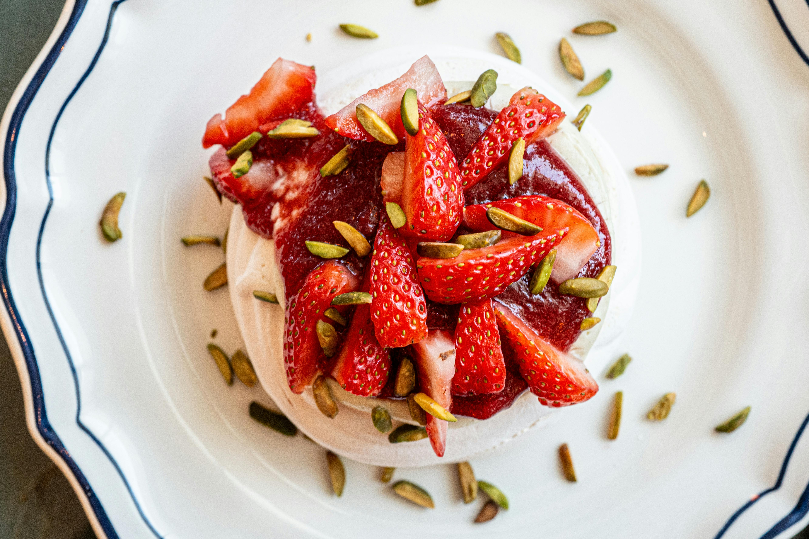

Html:

<!DOCTYPE html>
<html lang="pt-br">
<head>
    <meta charset="UTF-8">
    <title>Portfólio de Mateus Ueno</title>
    <link rel="stylesheet" href="style.css">
</head>
<body>
    <header>
        <h1>Mateus Ueno</h1>
        
Estudante | Amante de histórias intensas | Explorador da lógica e da imaginação

    </header>

    <section class="foto">
        
    </section>

    <section class="sobre">
        <h2>Sobre Mim</h2>
        
Sou Mateus, apaixonado por matemática e programação, mas também por narrativas fortes que desafiam limites. Neste espaço, compartilho um pouco das minhas criações, estudos e da forma como vejo o mundo — entre códigos e palavras que provocam.

    </section>

    <section class="projetos">
        <h2>Projetos em Destaque</h2>
        <ul>
            <li><strong>Leonardo Ferreira – Entre o Amor e a Revolta</strong>: Uma história intensa de redenção e descobertas.</li>
            <li><strong>Portfólio de Matemática II</strong>: Códigos, lógica e uma pitada de estilo pessoal.</li>
        </ul>
    </section>
</body>
</html>

css:

body {
    font-family: 'Segoe UI', Tahoma, Geneva, Verdana, sans-serif;
    margin: 0;
    padding: 0;
    background-color: #fff9f6;
    color: #333;
    line-height: 1.6;
    text-align: center;
}

header {
    background-color: #2e2e2e;
    color: white;
    padding: 40px 20px;
    box-shadow: 0 4px 8px rgba(0,0,0,0.2);
}

.foto img {
    width: 100%;
    max-height: 500px;
    object-fit: cover;
    border-bottom: 4px solid #ff4567;
}

section {
    padding: 30px 20px;
    max-width: 900px;
    margin: auto;
}

.sobre, .projetos {
    background-color: #fefefe;
    border-radius: 10px;
    box-shadow: 0 2px 10px rgba(0,0,0,0.1);
    margin-top: 20px;
}

ul {
    list-style-type: none;
    padding: 0;
}

ul li {
    padding: 10px 0;
}
